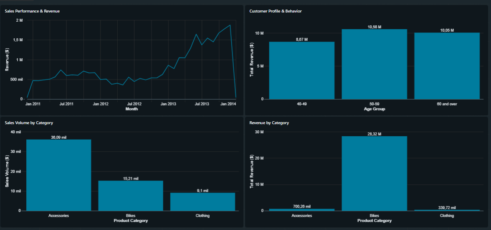

# 📊 Sales & Customer Insights — Dashboard

## Interactive dashboard built on Databricks SQL, powered by the **Silver** layer 
## of the Lakehouse (`sales_project_db.silver`), tracking sales performance, 
## product catalog trends, and customer behavior.

## Key Insights Tracked

- **Sales Performance:** historical revenue tracking and average ticket growth.
- **Product Catalog:** identification of high-value categories vs. high-volume items.
- **Customer Demographics:** customer purchasing behavior segmented by age group.

## Executive Summary & Business Insights

1. **Revenue Growth Trend** — historical data shows consistent, long-term revenue 
   growth, with notable cyclical seasonal spikes toward the end of each fiscal year.
2. **Product Performance Discrepancy**
   - *Bikes* is the primary revenue engine, generating over $20M in total sales.
   - *Accessories* dominates operational volume, with over 30,000 individual 
     transactions recorded.
3. **Target Demographics** — the highest-value customer segments are concentrated 
   in older age groups (50-59 and 60+), each generating over $10M in total revenue.
